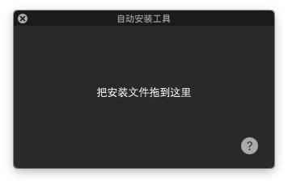

#### OSX软件自动化安装器实现源码

来自老谭笔记

http://www.tanhao.me/code/898.html/

<p align="center">

</p>

```
这个是我之前自己写的一个能够自动化安装PKG/DMG/APP/ZIP等常见的OSX程序安装包的一个测试工程。

主要的原理是根据安装包类型分别调用了OSX不同的系统命令进行相关操作，主要如下：

1.如果是APP/wdgt/prefpane等类型，则直接cp到相关的目录完成安装；

2.如果是PKG/MPKG，刚直接调用installer命令进行安装(在安装的时候弹出授权窗口获取ROOT权限);

3.如果是压缩包，则先解压缩，然后遍历所有文件，如果发现有APP/wdgt/prefpane等类型则用1中的方式安装，如果是PKG/MPKG，则使用2中的方式安装，如果是DMG，刚是4中的方法。

4.如果是DMG，则通过hdiutil工具获取磁盘内容(如果加密dmg，则会弹出窗口让用户输入密码)，然后用3中的方式继续实现安装。

虽然原理讲起来不复杂，但当时在编写这个工程时为了让它更加智能、有效，着实还是花了不少的时间来实现，目前测试能够安装大多数从网络中下载到的软件安装包，主要的适用情境为，如果你需要在你的软件中集成安装第三方软件的功能，他或许是非常有用的。
```